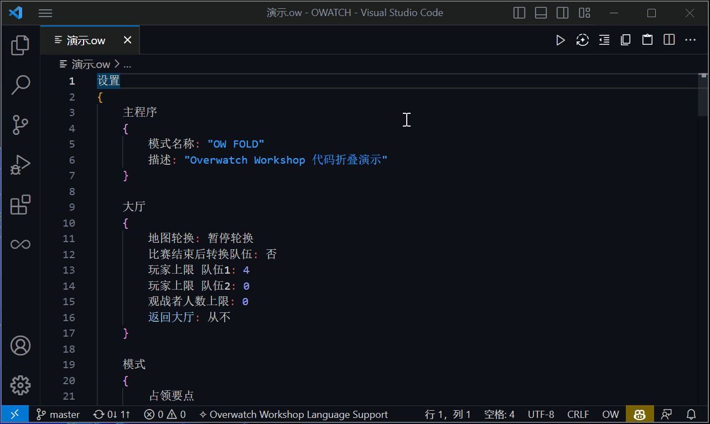
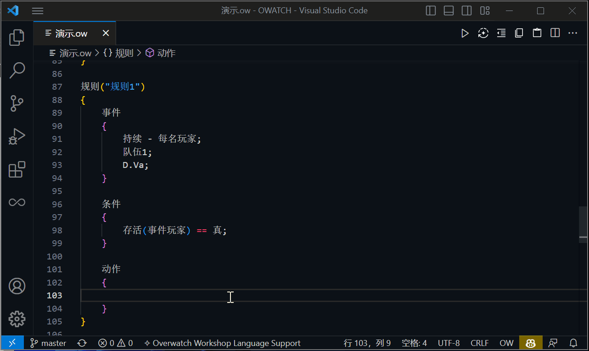

#   **Overwatch®** Workshop
## **守望先锋®** 工坊语言支持
 

# ***关键特性***

### **代码大纲**
在资源管理器的大纲视图提供详细大纲。具备跟踪光标和跳转能力。

    
演示

    

 

### **代码折叠**
代码折叠能力，包括代码块和流程控制。

    
演示

    

 

### **悬停提示**
将光标放置在关键词之上可获得详细提示。

    
演示

    

 

### **调色盘**
针对自定义颜色的预览和调制能力。

    
演示

    

 

### **补全建议**
汉字或拼音输入展开建议列表，可使用建议按钮强制触发。

    
演示

    

 

### **参数提示**
填充参数时会指示参数位和参数详情。

    
演示

    

 

### **语法高亮**
代码的精准上色能力。

 

### **参考手册**
侧边栏增加可收纳的参考手册视图。

    
演示

    

 

# ***快捷面板***

### ** 建议**
主动触发光标处的补全建议。

 

### ** 换行**
切换自动换行行为。

 

### ** 整理**
对编辑器内代码进行格式化。

 

### ** 复制**

导入到剪切板，同时修复已知的工坊错误。❶

 

### ** 粘贴**

导入到编辑器，同时修复已知的工坊错误。❶

 

### **❶ 已知的工坊错误**

*~~设置不可见(事件玩家, 无);~~*

    设置不可见(事件玩家, 全部禁用);

*~~追踪全局变量频率(A, 0, 1, 无);~~*

    追踪全局变量频率(A, 0, 1, 全部禁用);

*~~追踪玩家变量频率(事件玩家, A, 0, 1, 无);~~*

    追踪玩家变量频率(事件玩家, A, 0, 1, 全部禁用);

*~~持续追踪全局变量( A, 0, 1, 无);~~*

    持续追踪全局变量(A, 0, 1, 全部禁用);

*~~持续追踪玩家变量(事件玩家, A, 0, 1, 无);~~*

    持续追踪玩家变量(事件玩家, A, 0, 1, 全部禁用);

 

# ***联络***

**如果你发现任何错误或有任何建议，可通过以下方式与开发人员取得联络。**
|平台|描述|代码|链接|
|:--|:--|:--|:--|
|**QQ**|官方群|590621556|https://jq.qq.com/?_wv=1027&k=DTAuEetN|
|**KOOK**|官方频道|85357302|https://www.kookapp.cn/app/invite/XAD8eG|
|**DISCORD**|官方频道|NUm5HmZH69|https://discord.gg/NUm5HmZH69|
|~~**战网**~~|ID|你的对手#51441||
|**BATTLE**|ID|LXH#11992||

 

# ***鸣谢***

**整理语法数据和编写 [LSP](https://microsoft.github.io/language-server-protocol/) 是两个繁杂的过程，感谢以下大佬的资源和慷慨帮助。**

|大佬|贡献|链接|
|:--|:--|:--|
|**掌上天空**|*授权 + 开源仓库*|https://github.com/SkyinHand/owatch|
|**CoolP**|*开源仓库*|https://github.com/qaz075115961/owl-CN|
|**Zezombye**|*设置选项数据*|https://workshop.codes/workshop-ui|
|**春雨实验室**|*英雄图标和数据*|https://overlab.cn|
|**EbanCycle**|*开发成员*|
|**老王不在橱柜**|*荣誉成员*|
|**踏足**|*荣誉成员*|
 

# ***仓库***

**如果遇到显示问题，请尝试其它站点。**

|平台|链接|
|:--|:--|
|**GitHub**|https://github.com/XHanL/overwatch-workshop|
|**Gitee**|https://gitee.com/EbanCycle/overwatch-workshop|
 

# ***友情链接***

**插件的支持人员与合作伙伴们！**

|平台|描述|代码|
|:--|:--|:--|
|QQ|守望工坊修仙养老群|863964203|
|QQ|死亡之牢交流群|832284401|
|QQ|工坊模式发布群|832284401|
 