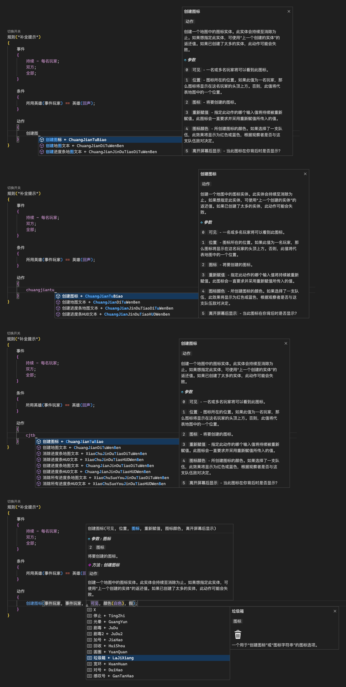

#  **Overwatch®** Workshop

### _**守望先锋 ®** 工坊语言支持_

 

## **主要功能**

### **参考手册**

- 侧边栏可激活手册视图，具有实用的 `图标表格` 等

  

  
预览图片

  
  

### **悬停提示**

- 将光标放置在关键词上弹出详细提示

  

  
预览图片

  
  

### **补全提示**

- `汉字/拼音/首字母` 激活补全提示，还可使用 `展开` 按钮显示全部选项

  

  
预览图片

  
  

### **参数提示**

- 填充参数时会指示参数位和参数详情

  

  
预览图片

  
  

### **代码混淆**

- 使用 `混淆` 选项导出混淆代码到剪切板

  

  
预览图片

  
  

### **代码整理**

- 使用右键菜单的 `格式化文档` 修正代码缩进

  

  
预览图片

  
  

### **代码折叠**

- 基于缩进的折叠能力

  

  
预览图片

  
  

### **代码大纲**

- 在资源管理器 `大纲视图` 中，具备跟踪光标和跳转能力

  

  
预览图片

  
  

### **代码高亮**

- 代码精准上色能力

  

  
预览图片

  
  

### **规则开关**

- 为每条规则生成 `禁用` 切换开关

  

  
预览图片

  
  

### **调色盘**

- 针对自定义颜色的预览和调制能力

  

  
预览图片

  
  

 

## **快速入门**

### **创建文件**

- 从顶部菜单选择 `文件 → 新建文件 → OW 文件`

### **打开文件**

- 从顶部菜单选择 `文件 → 打开`

### **保存文件**

- 从顶部菜单选择 `文件 → 保存`

### **导出代码**

- 打开任意 `.ow` 文件，点击右上方的 `导出` 按钮，或右键菜单中的 `导出` 选项

### **导入代码**

- 从工坊复制 `完整代码` 到剪切板

- 打开任意 `.ow` 文件，点击右上方的 `导入` 按钮，或右键菜单中的 `导入` 选项

### **建议列表**

- 将文本光标定位到目标位置，点击右上方的 `建议` 按钮，或右键菜单中的 `建议` 选项

- 使用方向键 `上` 和 `下` 滚动列表

 

## **_可选设置_**

### **VS Code 官方中文语言包**

- 在侧栏 ( 活动栏 ) 扩展市场中搜索以下扩展，待安装完成后重启 VS Code

  `Chinese (Simplified) (简体中文) Language Pack for Visual Studio Code`

### **Window 推荐字体**

- 从侧栏 ( 活动栏 ) 底部菜单选择 `设置`, 找到 `控制字体系列`，修改内容为

  `'Consolas Bold', 'Courier New', 'SimHei', monospace`

### **OW 推荐缩进**

- 从底栏 ( 状态栏 ) 找到并点击 `选择缩进` 区域

- 在弹出的菜单中选择 `使用制表符缩进` 并将 `更改制表符显示大小` 设置为 `4`

 

## **快捷功能**

- #### **_功能位于标签栏右侧以及右键菜单中！_**

  | 功能     | 描述                                        |
  | :------- | :------------------------------------------ |
  | **展开** | 展开光标处的补全提示列表。                  |
  | **换行** | 切换自动换行行为。                          |
  | **混淆** | 导出到剪切板，混淆并修复已知的工坊错误。❶ ❷ |
  | **导出** | 导出到剪切板，同时修复已知的工坊错误。❶     |
  | **导入** | 导入到编辑器，同时修复已知的工坊错误。❶     |

- ### **❶ 工坊错误**

  | 无 → 全部禁用       |
  | :------------------ |
  | 设置不可见          |
  | 开始治疗调整        |
  | 追踪全局变量频率    |
  | 追踪玩家变量频率    |
  | 持续追踪全局变量    |
  | 持续追踪玩家变量    |
  | 创建进度条地图文本  |
  | 创建地图文本        |
  | 创建进度条 HUD 文本 |
  | 创建 HUD 文本       |

- ### **❷ 混淆细节**

  | 注意事项               | 解决方法                                                                                                         |
  | :--------------------- | :--------------------------------------------------------------------------------------------------------------- |
  | 输入元素数量           | 可从 `地图工坊 → 显示诊断结果 → 总计元素数量` 获得，准确的数量可以避免生成过大的混淆文件，或为小文件提供更多保护 |
  | 混淆不完全             | 元素过多挤占混淆空间时，会按序丢弃 `混淆索引 → 填充规则 → 阻止篡改 → 阻止查看`，其它实现不占用元素               |
  | 导入需要很久           | 混淆代码数据量较大，不要乱点，耐心等待加载完成                                                                   |
  | 一般语法错误           | 请先导出 `正常代码` 检查是否有误，如确认混淆出错请联系开发人员                                                   |
  | 错误：脚本过大         | 一般由于 `总元素过多`，请酌情删减元素                                                                            |
  | 错误：自定游戏设置过大 | 一般由于 `单个规则过长`，请将规则拆分为多个                                                                      |
  | 名称比较失效           | 对于用于比较的玩家名称，请自行替换为原生文本                                                                     |
  | 数字比较失效           | 对于用于比较的数字，请自行替换为原生文本                                                                         |

 

## **_联络方式_**

- #### **_与开发人员交流！_**

  | 平台       | 描述    | 代码           | 链接                                                 |
  | :--------- | :------ | :------------- | :--------------------------------------------------- |
  | **QQ**     | 官方群  | 590621556      | _[邀请链接](https://jq.qq.com/?_wv=1027&k=DTAuEetN)_ |
  | **BATTLE** | 游戏 ID | LXH#11992      |                                                      |
  | **战网**   | 游戏 ID | 你的对手#51441 |                                                      |

- #### **_与合作伙伴们讨论！_**

  | 平台 | 描述               | 代码      | 链接                                                                                                                                                                                                    |
  | :--- | :----------------- | :-------- | :------------------------------------------------------------------------------------------------------------------------------------------------------------------------------------------------------ |
  | QQ   | 守望工坊修仙养老群 | 863964203 |                                                                                                                                                                                                         |
  | QQ   | 死亡之牢交流群     | 832284401 |                                                                                                                                                                                                         |
  | QQ   | 工坊模式发布群     | 694392121 | _[邀请链接](http://qm.qq.com/cgi-bin/qm/qr?_wv=1027&k=6VpQFnFhg7yJyR9S8W4U9SzKsT5G5d7l&authKey=XQqG8IFZ22pH61%2FX%2Fo%2FpeLoZCRbLKLG8ds4yogQMMcxcWjTT1WnIC0TXi4HnPfmx&noverify=0&group_code=694392121)_ |

 

## **_鸣谢_**

- #### **_整理语法数据和编写 [LSP](https://microsoft.github.io/language-server-protocol) 是两个繁杂的过程，感谢以下大佬的资源和慷慨帮助！_**

  | 大佬             | 贡献              | 链接                                                            |
  | :--------------- | :---------------- | :-------------------------------------------------------------- |
  | **掌上天空**     | _授权 & 开源仓库_ | _[SkyinHand/owatch](https://github.com/SkyinHand/owatch)_       |
  | **CoolP**        | _开源仓库_        | _[qaz075115961/owl-CN](https://github.com/qaz075115961/owl-CN)_ |
  | **DataWatch**    | _主要数据_        | _[overtools/OWLib](https://github.com/overtools/OWLib)_         |
  | **春雨实验室**   | _英雄数据_        | _[Overlab](https://overlab.cn)_                                 |
  | **EbanCycle**    | _荣誉成员_        |
  | **踏足**         | _荣誉成员_        |
  | **老王不在橱柜** | _荣誉成员_        |

 

## **_仓库_**

- #### **_源代码仓库，以及镜像仓库_**

  | 平台       | 链接                                                                      |
  | :--------- | :------------------------------------------------------------------------ |
  | **GitHub** | _[XHanL/overwatch-workshop](https://github.com/xhanl/overwatch-workshop)_ |
  | **Gitee**  | _[XHanL/overwatch-workshop](https://gitee.com/xhanl/overwatch-workshop)_  |

 

## **_许可_**

- ### **MIT License**

  _Copyright (c) 2023 present Crystal Platform_
