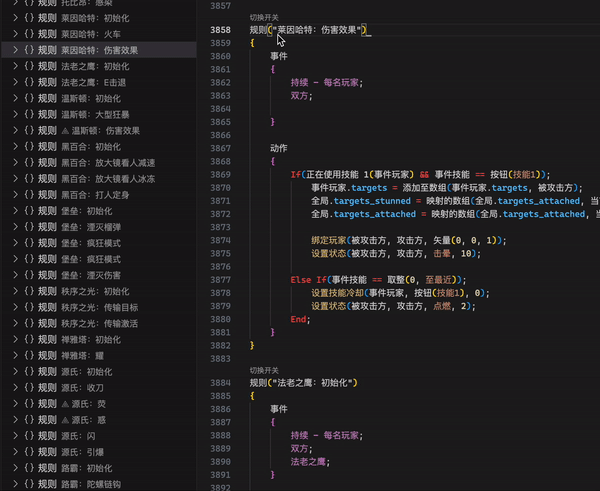

#### ⟁ 页面图床由 `Github` 托管，请确保网络具备科学性

#  **Overwatch®** Workshop

### **守望先锋 ®** 工坊语言支持

 

## **_快速入门_**

- ### 创建文件

  从顶部菜单选择 `文件 → 新建文件 → OW 文件`

- ### 打开文件

  从顶部菜单依次选择 `文件 → 打开`

- ### 保存文件

  从顶部菜单依次选择 `文件 → 保存`

- ### 导入代码

  从工坊复制 `完整代码` 到剪切板

  打开任意 `.ow` 文件，点击右上方的 `导入` 按钮，或右键菜单中的 `导入` 选项

- ### 导出代码

  打开任意 `.ow` 文件，点击右上方的 `导出` 按钮，或右键菜单中的 `导出` 选项

- ### 建议列表

  将文本光标定位到目标位置，点击右上方的 `建议` 按钮，或右键菜单中的 `建议` 选项

  使用方向键 `上` 和 `下` 滚动列表

 

## **_主要特性_**

- ### 代码大纲

  在资源管理器的大纲视图提供详细大纲。具备跟踪光标和跳转能力。

  >  

  >      
演示

  >      
  >  

- ### 代码折叠

  代码折叠能力，包括跨行括号块和流程控制。

  >  

  >      
演示

  >      
  >  

- ### 悬停提示

  将光标放置在关键词之上可获得详细提示。

  >  

  >      
演示

  >      
  >  

- ### 调色盘

  针对自定义颜色的预览和调制能力。

  >  

  >      
演示

  >      
  >  

- ### 补全建议

  汉字或拼音输入展开建议列表，可使用建议按钮强制触发。

  >  

  >      
演示

  >      
  >  

- ### 参数提示

  填充参数时会指示参数位和参数详情。

  >  

  >      
演示

  >      
  >  

- ### 参考手册

  侧边栏增加可收纳的参考手册视图。

  >  

  >      
演示

  >      
  >  

- ### 语法高亮

  代码的精准上色能力。

  >  

  >      
演示

  >      
  >  

- ### 规则开关

  自动在每条规则前生成一个可点击的禁用切换开关。

  >  

  >      
演示

  >      
  >  

   

## **_快捷功能_**

- #### _功能位于标签栏右侧以及右键菜单中。_

  | 功能           | 描述                                    |
  | :------------- | :-------------------------------------- |
  | **提供建议**   | 主动触发光标处的补全建议。              |
  | **自动换行**   | 切换自动换行行为。                      |
  | **修复后导出** | 导入到剪切板，同时修复已知的工坊错误。❶ |
  | **导入并修复** | 导入到编辑器，同时修复已知的工坊错误。❶ |

- #### ❶ 已知的工坊错误 ( 导入/导出 不一致 )

  > `设置不可见(事件玩家, 无 → 全部禁用);`

  > `追踪全局变量频率(A, 0, 1, 无 → 全部禁用);`

  > `追踪玩家变量频率(事件玩家, A, 0, 1, 无 → 全部禁用);`

  > `持续追踪全局变量(A, 0, 1, 无 → 全部禁用);`

  > `持续追踪玩家变量(事件玩家, A, 0, 1, 无 → 全部禁用);`

   

## **_联络方式_**

- #### _与开发人员交流！_

  | 平台       | 描述   | 代码           | 链接                                   |
  | :--------- | :----- | :------------- | :------------------------------------- |
  | **QQ**     | 官方群 | 590621556      | https://jq.qq.com/?_wv=1027&k=DTAuEetN |
  | **BATTLE** | ID     | LXH#11992      |                                        |
  | **战网**   | ID     | 你的对手#51441 |                                        |

- #### _与合作伙伴们讨论！_

  | 平台 | 描述               | 代码      |
  | :--- | :----------------- | :-------- |
  | QQ   | 守望工坊修仙养老群 | 863964203 |
  | QQ   | 死亡之牢交流群     | 832284401 |
  | QQ   | 工坊模式发布群     | 694392121 |

   

## **_鸣谢_**

- #### _整理语法数据和编写 [LSP](https://microsoft.github.io/language-server-protocol/) 是两个繁杂的过程，感谢以下大佬的资源和慷慨帮助！_

  | 大佬             | 贡献              | 链接                                   |
  | :--------------- | :---------------- | :------------------------------------- |
  | **掌上天空**     | _授权 + 开源仓库_ | https://github.com/SkyinHand/owatch    |
  | **CoolP**        | _开源仓库_        | https://github.com/qaz075115961/owl-CN |
  | **春雨实验室**   | _英雄图标和数据_  | https://overlab.cn                     |
  | **Zezombye**     | _设置选项数据_    | https://workshop.codes/workshop-ui     |
  | **EbanCycle**    | _开发成员_        |
  | **踏足**         | _开发成员_        |
  | **老王不在橱柜** | _荣誉成员_        |

   

## **_仓库_**

- #### _如果喜欢这个项目，请为项目加一颗星，或帮助项目贡献！_

  | 平台       | 链接                                          |
  | :--------- | :-------------------------------------------- |
  | **GitHub** | *https://github.com/XHanL/overwatch-workshop* |

   

## **_待办_**

- #### _需要帮忙的地方！_
  | 任务               | 细节                                 |
  | :----------------- | :----------------------------------- |
  | **手册数据 - PNG** | _手册中所有模式，所有地图的预览图片_ |
  | **手册数据 - GIF** | _手册中所有弹道，所有效果的循环预览_ |
